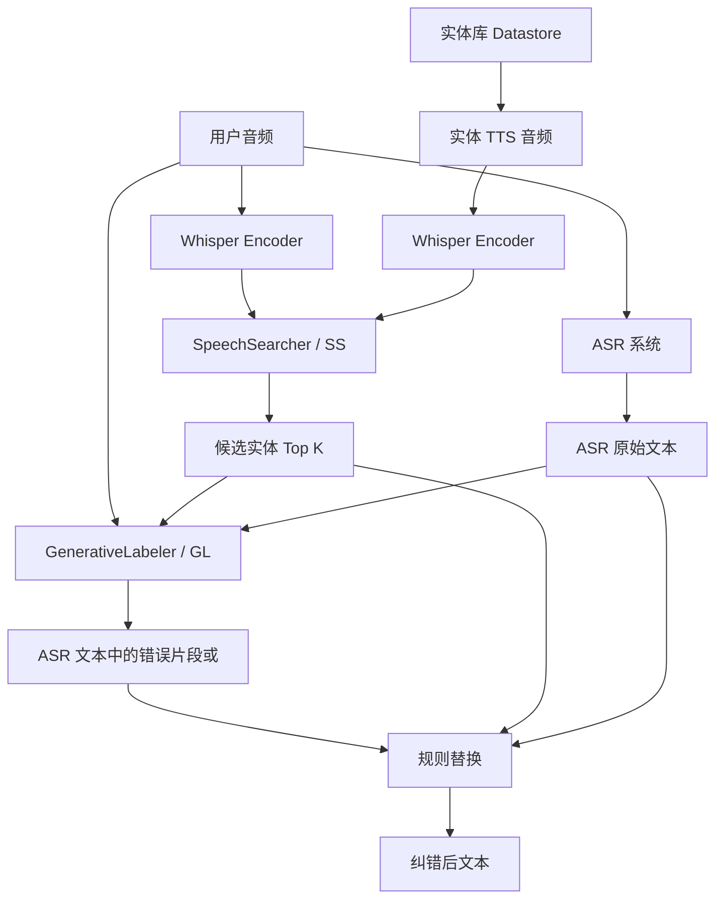
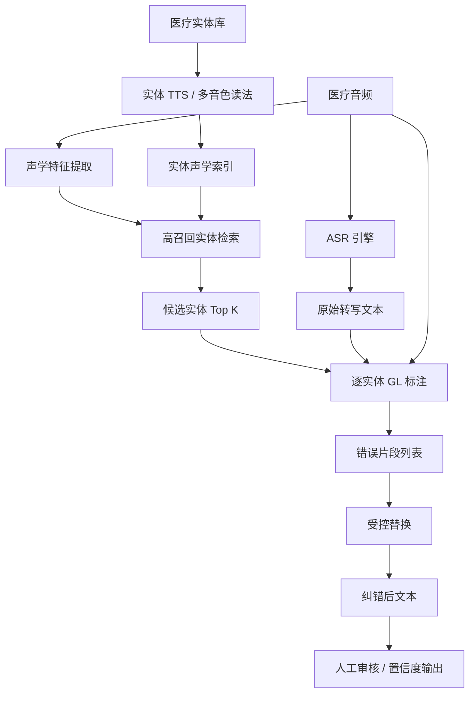

创建时间：07-14

## ASR 命名实体纠错模型架构理解

这篇论文里的方法不是一个单独的“文本纠错模型”，而是一个用于 ASR 后处理的两阶段系统。它的核心目标是解决一个具体问题：ASR 经常把专业实体、药品名、人名、产品名、外来词、数字混合实体转错，而且错误文本和真实实体在字面形式上可能差很多。

例如：

```text
真实说法：我用了很多二甲双胍片
ASR 输出：我用了很多是二甲双瓜片
正确实体：二甲双胍片
```

传统基于文本或音素编辑距离的方法容易依赖“错误文本和正确实体长得比较像”。但在很多真实场景里，ASR 错误结果和正确实体的字面形式并不稳定，比如：

```text
ChatGPT -> Check GPT / 切特 GPD
Midjourney -> 米德仲尼
MateBook D 16 -> matebook 第 16
二甲双胍片 -> 二甲双瓜片 / 是二甲双瓜片
```

因此论文把问题拆成两个子问题：

1. 音频里可能说了哪些实体？
2. ASR 文本中哪一段应该被这些实体替换？

对应系统组件就是：

```text
SpeechSearcher（SS，语音实体检索）
GenerativeLabeler（GL，生成式错误标注）
规则替换器
```

整体流程如下：



## 一、实体库 Datastore 是什么

系统需要提前准备一个实体库。实体可以来自业务词表，比如医疗药品名、医生姓名、检查项目、科室名、产品名、公司名、热词等。

对每个实体，系统先用 TTS 合成一段实体读音，然后用 Whisper encoder 编码，得到实体的声学表示。

形式上可以理解为：

```text
实体文本 -> TTS 音频 -> Whisper encoder -> 实体声学帧表示
```

实体库里存的不是简单字符串，而是：

```text
[
  {
    entity: "二甲双胍片",
    audio_repr: 二甲双胍片的声学表示
  },
  {
    entity: "阿卡波糖",
    audio_repr: 阿卡波糖的声学表示
  }
]
```

这样做的好处是：新增实体不一定要重新训练模型。理想情况下，只要新增实体文本，再生成 TTS 音频，编码后写入 datastore，就可以参与后续检索。

## 二、SS：语音实体检索模型的输入和输出

SS 的任务是判断：一整段用户音频里是否出现了某个候选实体的声音。

它的输入是：

```text
A. 用户整段音频
B. 某个实体的 TTS 音频
```

例如：

```text
用户音频：我用了很多二甲双胍片
实体音频：二甲双胍片 的 TTS 读音
```

SS 的输出是一个概率：

```text
p = 0.87
```

含义是：

```text
这段用户音频中包含“二甲双胍片”的概率是 0.87
```

对实体库中多个实体分别计算后，就得到候选实体列表：

```text
[
  ("二甲双胍片", 0.87),
  ("阿卡波糖", 0.76),
  ("格列美脲", 0.22)
]
```

超过阈值的实体会进入下一步。论文中提到，实体检索时概率大于 0.3 的候选实体会被选入 prompt，每个语音片段最多保留 5 个候选实体。

## 三、整段音频是否直接拿去和实体做 embedding 检索

需要注意：论文不是把整段音频压成一个句向量，然后和实体向量做简单相似度比较。

更准确的过程是：

```text
整段用户音频
  -> Whisper encoder
  -> 一串时间帧表示 s' = [frame1, frame2, ..., frameT]

实体 TTS 音频
  -> Whisper encoder
  -> 一串时间帧表示 x' = [entity_frame1, ..., entity_frameN]
```

然后用 attention 判断实体声音是否能在整段音频的某个局部位置被找到：

```text
query = 实体音频帧表示 x'
key/value = 整段音频帧表示 s'
```

可以把它理解为：

```text
实体“二甲双胍片”的声音作为查询，
去整段音频“我用了很多二甲双胍片”里找相似的局部声音片段。
```

这比整句平均池化更合理。因为实体通常只占整段音频的一小部分。如果把整段音频压成一个向量，实体信息会被上下文稀释。

例如一句话有 5 秒：

```text
我用了很多二甲双胍片，然后今天血糖好多了
```

其中“二甲双胍片”可能只占 0.8 秒。如果直接做整句 embedding，相似度会被“我用了很多”“然后今天血糖好多了”这些非实体部分影响。论文使用帧级表示和 attention，本质上是在做软定位。

## 四、GL：生成式错误标注模型的输入和输出

GL 的任务不是直接生成最终纠错文本，而是生成 ASR 文本中应该被替换的错误片段。

它的输入有三部分：

```text
A. 用户整段音频
B. SS 检索出来的候选实体列表
C. ASR 原始转写文本
```

文本 prompt 的形式是：

```text
候选实体1 ||| 候选实体2 ||| ... <EC> ASR 原始文本
```

例如：

```text
二甲双胍片 ||| 阿卡波糖 <EC> 我昨天用了是二甲双瓜片，晚上又吃了阿卡播糖。
```

GL 的输出是：

```text
ASR 文本里需要被替换的错误片段
```

例如：

```text
二甲双瓜片 ||| 阿卡播糖
```

如果某个候选实体不需要纠正，则输出：

```text
<empty>
```

所以 GL 不是输出：

```text
我昨天用了是二甲双胍片，晚上又吃了阿卡波糖。
```

而是输出：

```text
二甲双瓜片 ||| 阿卡播糖
```

最后由规则替换器把错误片段替换成对应实体。

## 五、为什么不直接生成完整纠错文本

论文选择“生成错误片段”而不是“生成完整纠错文本”，是一个重要设计。

如果让模型直接生成完整纠错文本，模型可能会改掉不该改的普通词，也可能引入幻觉。例如它可能把句子润色、补词、删词，导致 ASR 原始内容被破坏。

而生成式标注更克制：

```text
GL 只负责指出“哪一段错了”
规则替换器负责把它替换成实体库里的标准实体
```

这样最终输出受到实体库约束，稳定性更好。

## 六、多个候选实体时输出格式如何理解

论文中的 Table 1 说明，当检索到多个候选实体时，GL 的输出顺序与候选实体顺序对应。

例如候选实体是：

```text
实体1：二甲双胍片
实体2：格列美脲
实体3：阿卡波糖
```

prompt 是：

```text
二甲双胍片 ||| 格列美脲 ||| 阿卡波糖 <EC> 我昨天用了是二甲双瓜片，晚上又吃了阿卡播糖。
```

如果 GL 输出：

```text
二甲双瓜片 ||| <empty> ||| 阿卡播糖
```

含义是：

```text
实体1“二甲双胍片”对应 ASR 错误片段“二甲双瓜片”
实体2“格列美脲”没有对应错误片段，不纠正
实体3“阿卡波糖”对应 ASR 错误片段“阿卡播糖”
```

替换后得到：

```text
我昨天用了是二甲双胍片，晚上又吃了阿卡波糖。
```

## 七、同一个候选实体对应多个错误片段

论文还提到，同一个候选实体可以匹配多个错误片段。

例如 ASR 文本是：

```text
早上吃了二甲双瓜，晚上又补了一片二甲双孤。
```

候选实体是：

```text
实体1：二甲双胍片
实体2：格列美脲
实体3：阿卡波糖
```

prompt 是：

```text
二甲双胍片 ||| 格列美脲 ||| 阿卡波糖 <EC> 早上吃了二甲双瓜，晚上又补了一片二甲双孤。
```

GL 可以输出：

```text
二甲双瓜,二甲双孤 ||| <empty> ||| <empty>
```

含义是：

```text
实体1“二甲双胍片”对应两个错误片段：“二甲双瓜”和“二甲双孤”
实体2“格列美脲”不纠正
实体3“阿卡波糖”不纠正
```

替换后得到：

```text
早上吃了二甲双胍片，晚上又补了一片二甲双胍片。
```

这里的核心规则是：

```text
候选实体顺序：
实体1 ||| 实体2 ||| 实体3

模型输出顺序：
实体1对应错误片段 ||| 实体2对应错误片段 ||| 实体3对应错误片段
```

## 八、论文是否只假设一句话纠一个实体

不是。论文设计上支持：

```text
多个候选实体
候选实体不命中时输出 <empty>
一个候选实体对应多个错误片段
一条 ASR 文本中出现多个需要纠正的实体
```

但需要区分“架构能力”和“训练数据分布”。

论文附录中提到，训练数据里大多数句子只包含一个实体，只有少数句子包含两个实体。也就是说，论文方法不是理论上只能处理一个实体，而是原实验数据没有重点覆盖复杂多实体场景。

如果要落地到医疗场景，尤其是药品、检查项目、疾病名经常在一句话里同时出现的场景，应该专门构造多实体训练样本。例如：

```text
我早上吃了二甲双胍片，中午加了阿卡波糖，晚上还打了胰岛素。
```

并且让训练数据覆盖：

```text
一句话一个实体
一句话两个实体
一句话多个实体
同一实体重复出现
候选实体命中但不该纠正
候选实体发音相似但语义不匹配
```

## 九、实体拒绝能力为什么重要

GL 有一个重要能力：输出 `<empty>`。

这表示：

```text
虽然 SS 检索出了这个候选实体，但 GL 判断 ASR 文本里没有对应错误片段，因此不纠正。
```

这个能力让第一阶段检索可以更偏向高召回。也就是说，SS 可以多给几个候选实体，不必追求特别高的精确率，因为第二阶段 GL 可以拒绝不该纠正的实体。

例如：

```text
候选实体：韩宇
ASR 文本：韩雨老师教的韩语非常好
```

这里“韩雨”和“韩语”都可能和“韩宇”发音相似，但只有“韩雨”是人名语境，应该纠成“韩宇”；“韩语”表示 Korean language，不应该纠正。

论文认为 GL 可以借助生成模型的语言能力和上下文信息，判断哪个片段更像真正需要纠正的实体错误。

## 十、对应代码中的两个模型如何调用

之前写的 PyTorch 代码中对应两个类：

```text
SpeechSearcher
GenerativeLabeler
```

文件位置：

```text
[[generative_annotation_nec_pytorch.py]]
```

调用顺序是：

```text
1. SpeechSearcher 扫描实体库，得到 top K 候选实体
2. GenerativeLabeler 根据候选实体和 ASR 文本生成错误片段
3. apply_correction 做规则替换
```

整体调用可以理解为：

```text
correct_one_utterance(
    searcher=SpeechSearcher,
    labeler=GenerativeLabeler,
    utterance_features=用户音频特征,
    asr_text=ASR 原始文本,
    datastore=实体库,
    threshold=0.3,
    top_k=5
)
```

其中 datastore 中每个元素类似：

```text
EntitySpeech(
    entity="二甲双胍片",
    input_features=二甲双胍片 TTS 音频特征
)
```

在论文式调用中，GL 可以一次接收多个候选实体：

```text
二甲双胍片 ||| 格列美脲 ||| 阿卡波糖 <EC> ASR 文本
```

然后输出：

```text
二甲双瓜片 ||| <empty> ||| 阿卡播糖
```

不过工程上还有一种更稳的调用方式：SS 先召回多个候选实体，GL 再逐个实体判断。

例如：

```text
二甲双胍片 <EC> ASR 文本 -> 二甲双瓜片
格列美脲 <EC> ASR 文本 -> <empty>
阿卡波糖 <EC> ASR 文本 -> 阿卡播糖
```

这种方式的好处是输出格式更简单，替换逻辑更容易控制。缺点是 GL 要调用多次，延迟更高。

## 十一、医疗场景落地时的建议架构

如果把这个方法用于医疗 ASR 纠错，我更建议采用下面这种工程架构：



关键策略：

1. 实体检索宁可多召回，不要漏召回。
2. GL 必须具备 `<empty>` 拒绝能力，避免过纠正。
3. 医疗实体库要支持动态更新。
4. 多实体训练数据必须专门构造，不能只依赖一句一个实体的数据。
5. 替换器要保守，不能让模型自由改写整句话。
6. 输出最好带置信度和替换日志，方便人工复核。

替换日志可以长这样：

```text
原始 ASR：我昨天用了是二甲双瓜片，晚上又吃了阿卡播糖。
候选实体：二甲双胍片, 阿卡波糖
GL 标注：二甲双瓜片, 阿卡播糖
替换结果：
  二甲双瓜片 -> 二甲双胍片
  阿卡播糖 -> 阿卡波糖
最终文本：我昨天用了是二甲双胍片，晚上又吃了阿卡波糖。
```

## 十二、一句话总结

这个方法的本质是：

```text
先用音频从实体库里找“可能说了哪些实体”，
再用生成模型从 ASR 文本里找“这些实体对应的错误片段”，
最后用规则把错误片段替换成标准实体。
```

SS 的输入是整段音频和实体 TTS 音频，输出实体出现概率；GL 的输入是整段音频、候选实体和 ASR 原始文本，输出待替换错误片段或 `<empty>`。论文设计上支持多个候选实体和多个错误片段，但训练数据主要是一句一个实体。因此，如果用于医疗、药品等多实体场景，需要专门构造多实体训练数据，并在工程上优先采用“SS 高召回检索多个实体，GL 逐实体判断并保守替换”的架构。
