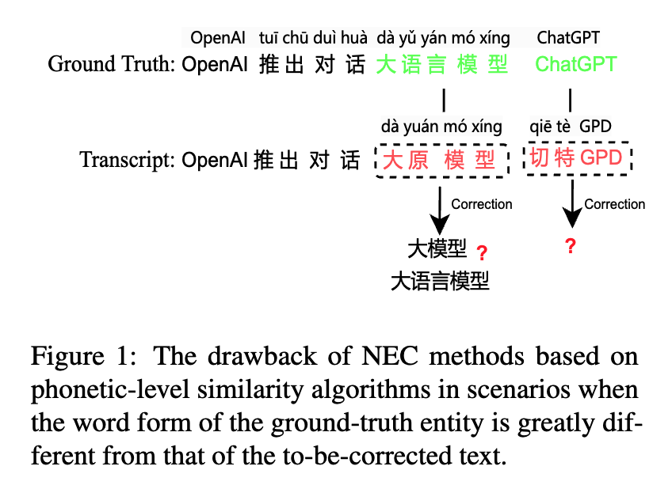
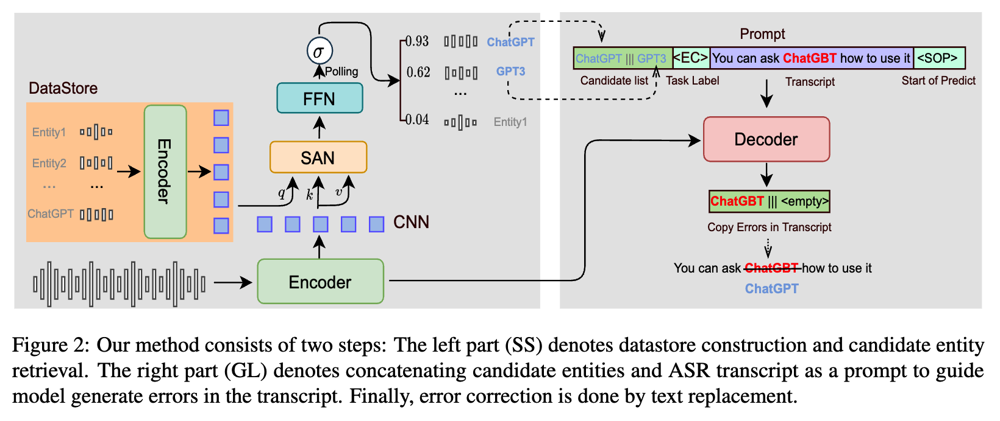
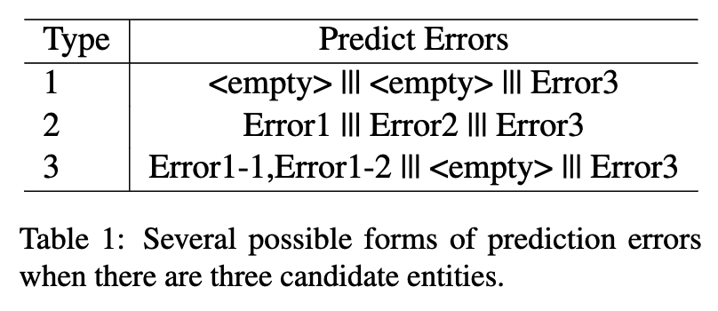
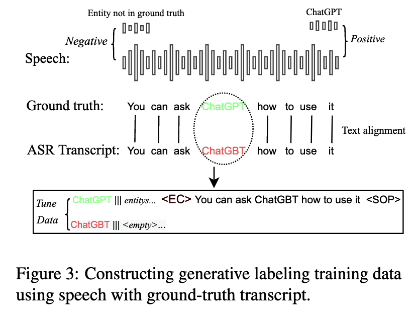
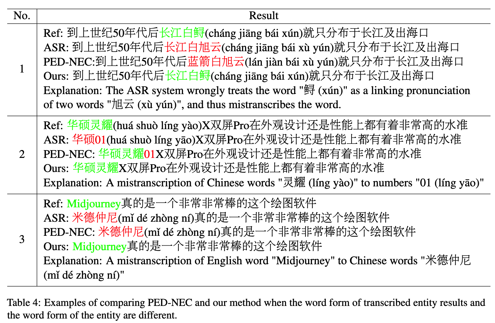
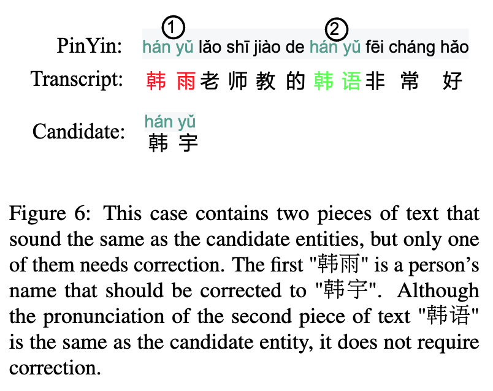

记录时间：[[07-14|2026-07-14]]

来源：[[arxiv_2508.20700.pdf]]

说明：本文件为论文 Generative Annotation for ASR Named Entity Correction 的中文翻译版，不插入图片。原论文中的图、表、公式、附录与案例以文字方式保留。

## 用于 ASR 命名实体纠错的生成式标注

作者：Yuanchang Luo、Daimeng Wei、Shaojun Li、Hengchao Shang、Jiaxin Guo、Zongyao Li、Zhanglin Wu、Xiaoyu Chen、Zhiqiang Rao、Jinlong Yang、Hao Yang

单位：Huawei Translation Service Center, Beijing, China

邮箱：{luoyuanchang1,weidaimeng,lishaojun18,shanghengchao,guojiaxin1,lizongyao,wuzhanglin2,chenxiaoyu35,raozhiqiang,yangjinlong7,yanghao30}@huawei.com

Yuanchang Luo、Daimeng Wei 和 Shaojun Li 为共同一作。

## 摘要

端到端自动语音识别 ASR 系统经常无法正确转写领域特定的命名实体，从而在下游任务中造成灾难性错误。近年来，研究者提出了许多快速、轻量的命名实体纠错 NEC 模型。这些模型主要利用音素层面的编辑距离算法，已经展现出不错的效果。然而，当被错误转写的词与真实命名实体在字面形式上差异很大时，这些方法往往无法在假设转写文本中定位被错误转写的词，因此限制了使用范围。

本文提出一种新的 NEC 方法，使用语音声音特征检索候选实体。在语音声音特征和候选实体的基础上，本文创新性地设计了一种生成式方法，用来标注 ASR 转写文本中的实体错误，并将错误文本替换为正确实体。该方法在词形差异场景中有效。本文在开源测试集和自建测试集上验证了该方法。结果表明，本文提出的 NEC 方法能够显著提升实体准确率。自建训练数据和测试集已公开在 github.com/L6-NLP/Generative-Annotation-NEC。

## 1 引言

端到端 ASR 系统近年来取得了显著进步。弱监督数据和无监督数据的广泛使用进一步提升了 ASR 性能。当前最先进的 ASR 模型在 GigaSpeech、LibriSpeech 等开源 ASR 测试集上已经取得了相当低的词错误率 WER。然而，这些模型仍然经常把领域特定词汇，例如人名、地名或组织名，错误转写成普通词，从而造成严重误解。

近年来，许多工作提出了用于纠正 ASR 转写中命名实体错误的 NEC 方法。本文将这些方法分为两类：第一类是在转写生成过程中同时纠错；第二类是在转写生成之后纠错，也就是后编辑错误纠正。

在第一类方法中，一些工作通过训练附加模块，让 ASR 模型具备上下文偏置能力。另一些方法直接使用文本预训练模型来纠正转写错误。第一类方法需要修改 ASR 系统本身，才能让系统具备错误纠正能力，因此很难应用到第三方 ASR 系统中。

相比之下，第二类方法不需要修改 ASR 系统，因此后编辑 NEC 方法更具适用性，尤其适用于使用云端 ASR 系统的场景。该方向近期工作主要关注推理速度慢、非自回归模型缺乏音系约束等问题。其中，基于文本和音素层面相似度，并通过编辑距离算法计算相似度的快速轻量方法表现出了显著效果。下文将这种方法称为 PED-NEC。

然而，尽管 PED-NEC 简单有效，但当真实实体和待纠错文本的词形差异很大时，它的效果会明显下降。当实体和 ASR 转写中的相关错误文本形式相近时，可以通过遍历实体数据库轻松定位错误。但当二者形式不同，仅靠遍历真实实体数据库就很难定位需要纠正的词。

如图 1 所示，中文 ASR 模型将 “大语言模型” 错误转写为 “大 原 模 型”。基于文本和音素层面编辑距离的方法很难判断正确实体究竟是 “大模型” 还是 “大语言模型”，因为错误内容的字面形式与正确实体不同。这个问题在外来词和包含数字的实体中尤其常见。例如，中文 ASR 系统会把 “ChatGPT” 转写为 “切特 GPD”，这对基于音系相似度搜索的 NEC 方法尤其困难。

为解决上述问题，本文创新性地提出一种使用生成式方法标注待纠错文本的 NEC 方法。具体而言，本文利用语音声音特征、候选命名实体和 ASR 转写文本，生成或标注转写文本中需要纠正的词，并据此执行纠错。这种基于错误标注的 NEC 方法先识别待纠错文本，再完成端到端文本纠正，不需要处理复杂的词形变化，因此优于以往基于规则替换的方法。

本文在开源 Aishell 测试集和自建 BuzzWord 测试集上验证方法有效性，结果表明本文方法优于 PED-NEC。特别是在待纠错文本与正确实体词形不同的场景，以及更具挑战性的 BuzzWord 测试集上，本文方法显著优于 PED-NEC。

## 2 方法

PED-NEC 的基本依据是，ASR 系统经常把实体错误转写为音系相似的普通词。PED-NEC 是两步方法：第一步，基于语音声音相似性进行实体检索；第二步，执行文本纠正。相比 PED-NEC，本文方法将第一步替换为直接使用音频进行检索。本文认为这有助于解决 “切特 GPD” 这类 NEC 错误。随后，本文使用生成式方法进行文本纠错。

本文方法基于一个预训练的基于注意力的编码器-解码器 AED ASR 系统。纠错流程如图 2 所示。首先预先构建一个 datastore，用于存储实体的音频-文本对。获得语音片段和 ASR 转写文本后，系统执行语音检索，判断语音片段中的某一部分是否与 datastore 中某个候选实体具有相似的语音声音特征。如果存在相似实体，则将候选实体和 ASR 转写文本拼接为 prompt，引导纠错模型生成 ASR 转写中与正确实体对应的可能错误词。最后，将错误文本替换为 datastore 中的正确实体。下面详细介绍每一步。

### 2.1 Datastore 创建

对于收集到的实体列表 X = {x1, x2, ... xn}，可以通过文本转语音 TTS 引擎获得每个实体的语音：

Speechxi = TTS(xi) （1）

随后，将 TTS 生成的音频输入编码器，并使用编码器最后一层的输出作为实体 xi 的音系表示。为了提升检索准确率并降低内存占用，本文在编码器末端添加一个卷积神经网络 CNN 层。因此，实体 xi 的音频表示为：

x′i = CNN(Encoder(Speechxi)) （2）

最终，datastore 存储键值对，即表示-实体对：

{(x′1, x1), (x′2, x2), ... (x′i, xi) ...} （3）

### 2.2 实体检索

接着，将语音片段 s 输入编码器，并从编码器最后一层输出获得其表示 s′：

s′ = CNN(Encoder(s)) （4）

本文引入自注意力网络 SAN 和前馈网络 FFN，计算语音片段 s 中是否包含 datastore 中候选实体 x′i 的概率 pi。该概率表示为：

pi = Sigmoid(FFN(SAN(q = x′i; k, v = s′))) （5）

需要注意的是，输入 SAN 的 q 是 x′i 的表示，k 和 v 是候选实体 s′ 的 key 和 value。此外，本文在 FFN 之后使用平均池化进行最终分类。

最后得到概率集合：

{p1, p2, ... pi ...} （6）

它表示 datastore 中各实体是否出现在语音片段中。如果概率 pi 高于设定阈值，则选择 top K 个候选实体用于后续纠错。

图 2 说明：本文方法由两个步骤组成。左侧 SS 表示 datastore 构建和候选实体检索；右侧 GL 表示将候选实体和 ASR 转写文本拼接为 prompt，引导模型生成转写文本中的错误。最后，通过文本替换完成错误纠正。

### 2.3 错误纠正

通过上述实体检索步骤获得若干候选实体后，如图 2 所示，本文先用符号 “|||” 拼接实体，再用 “<EC>” 将实体字符串与 ASR 转写文本拼接。这个实体加转写文本的字符串被用作 prompt，引导纠错模型生成转写文本中与候选实体具有相似声音特征的错误实体。这个过程本质上是一种生成式标注方法，因为纠错模型输出原始 ASR 转写文本中的一个或多个词。

本文的生成式方法对待纠错文本和候选实体之间的词形差异不敏感，因此可以解决图 1 所描述的问题。

此外，本文方法还具备实体拒绝能力。如果模型无法把某个候选实体与转写文本中的潜在错误实体匹配起来，它会生成符号 “<empty>”，表示没有返回结果。

本文认为，该方法能够更容易地识别待纠错文本，因为它同时结合了原始音频、候选实体和错误转写文本。模型的目标是找到既与候选实体声音相似、又符合语言模型约束的待纠错文本。最后一步是将错误文本替换为 datastore 中的真实实体。

通过生成式方法预测错误文本，可以轻松处理多种错误纠正场景。如表 1 所示，当检索到 3 个候选实体时，纠错模型返回结果可能有多种格式。如果某个候选实体与转写文本中的任何片段都不匹配，则返回 “<empty>” 跳过纠错。此外，当一个候选实体匹配多个错误时，本文方法可以全部纠正。

## 3 实验设置

### 3.1 训练数据

为了训练纠错模型，需要在真实转写文本中标注实体。借助 Chen et al.（2022）和 Yadav et al.（2020）的工作，本文获得了 Aishell 数据集中的 54,129 个中文实体。本文参考他们的标注框架构造训练数据。包含标注实体的音频-文本对作为正样本，不包含实体的音频-文本对作为负样本，负样本数量为正样本的 10 倍。实体语音由 TTS 生成。

如图 3 所示，为了让预训练模型具备错误纠正能力，本文使用上述预标注实体数据构造微调数据。首先使用 Whisper-base 模型生成可能包含错误实体的 ASR 转写文本，并通过编辑距离将它们与正确实体对齐。微调数据量小于训练分类模型所使用的数据量。

本文只使用 10k 条训练数据。为了让模型在不需要纠错时生成 “<empty>”，20% 的 prompt 包含不在转写文本中的实体，或者只包含部分正确实体。例如，如果需要纠正的实体是 “文心一言”，prompt 中的实体可能是 “文心言”，此时预期结果是 “<empty>”。

需要注意的是，本文所有训练数据都可以基于当前开源数据自动构造，因此其他研究者可以较容易地复现实验。

图 3 说明：使用带有真实转写文本的语音构造生成式标注训练数据。

### 3.2 测试集

本文使用两个测试集验证 NEC 方法的有效性。一个是 Aishell 测试集，另一个是本文自建的 BuzzWord 测试集。

本文将 Aishell 开发集和测试集中的去重命名实体合并，共 3,101 个实体，作为 Aishell 测试集的命名实体数据库。为了更好地展示本文方法在挑战场景中的有效性，本文构建了 BuzzWord 测试集。

这些 buzzword 中有一些是长实体、外来词，或者由数字组成的实体，对 ASR 系统非常具有挑战性。ASR 系统转写这些词时，输出词形往往与真实 buzzword 差异很大。

BuzzWord 测试集包含 2023 年 1 月至 2024 年 1 月期间的 1500 个短语音片段及其对应真实转写文本。在测试集中，本文构造了 500 个包含 buzzword 的正样本，以及 1000 个不包含 buzzword 的负样本。

为了让测试集更接近真实错误纠正场景，本文考虑了语音多样性。对于每个 buzzword，本文从至少 5 位说话人处收集 10 个正样本，并仔细平衡男女声音。负样本也来自这些说话人。buzzword 可能出现在语音片段开头、中间或结尾，也可能在一个语音片段中出现多次。BuzzWord 测试集的细节见附录表 5。

虽然本文只有 50 个 buzzword，但实验表明该测试集对现有 ASR 系统具有很大挑战。

### 3.3 评价指标

参考 Wang et al.（2024）的工作，本文使用 4 个关键指标评估不同 NEC 方法的性能：

- CER：衡量整个测试集的总字符错误率。
- NNE-CER：衡量不属于实体的字符的字符错误率。
- NE-CER：衡量构成实体的字符的字符错误率。
- NE-Recall：衡量文本中被准确识别的实体召回率。

### 3.4 参数

本文使用的 ASR AED 预训练模型是 Whisper-base。在语音分类中，本文使用窗口大小为 3、步幅为 2 的一维 CNN。SAN 的维度为 512，FFN 的隐藏层维度为 2048。训练时使用 1 块 GPU，batch size 为 512，学习率为 5e-5。本文使用自建开发集判断模型收敛情况。预训练模型的编码器参数在训练和微调期间被冻结。微调时 batch size 设置为 64，学习率为 1e-4。实体检索时，如果概率大于 0.3，则选择该候选实体作为 prompt，每个语音片段最多包含 5 个候选实体。

表 2：本文方法在 Aishell 测试集和自建 Word Form Variation Set 上的错误纠正结果。

| 模型 | Aishell CER↓ | Aishell NNE-CER↓ | Aishell NE-CER↓ | Aishell NE-Recall↑ | Word Form CER↓ | Word Form NNE-CER↓ | Word Form NE-CER↓ | Word Form NE-Recall↑ |
| --- | ---: | ---: | ---: | ---: | ---: | ---: | ---: | ---: |
| Whisper | 10.47 | 10.00 | 15.41 | 70.85 | 18.99 | 18.10 | 25.34 | 25.4 |
| PED-NEC | 10.40 | 10.42 | 10.85 | 83.34 | 17.60 | 18.32 | 13.58 | 50.79 |
| PED+GL | 10.00 | 10.00 | 10.03 | 84.34 | 16.76 | 18.12 | 12.55 | 50.85 |
| SS+NEC | 10.26 | 10.41 | 8.34 | 86.20 | 17.01 | 18.19 | 13.05 | 50.82 |
| SS+GL | 9.85 | 10.01 | 7.41 | 87.31 | 11.45 | 18.10 | 7.53 | 86.51 |

表 3：本文错误纠正方法在 BuzzWord 测试集上的实验结果。

| 模型 | CER↓ | NNE-CER↓ | NE-CER↓ | NE-Recall↑ |
| --- | ---: | ---: | ---: | ---: |
| Whisper | 16.23 | 15.29 | 46.49 | 12.22 |
| PED-NEC | 10.67 | 15.49 | 23.62 | 61.82 |
| PED+GL | 15.00 | 15.29 | 12.9 | 79.96 |
| SS+NEC | 16.01 | 15.47 | 17.40 | 70.03 |
| SS+GL | 14.77 | 15.29 | 7.26 | 87.47 |

### 3.5 基线系统

所有测试集的 ASR 结果均由 Whisper 生成。Whisper 使用大量弱监督数据训练。本文实验使用 Whisper-large v2。系统比较时，本文重点关注基于音素级编辑距离的方法，也就是前面提到的 PED-NEC，并将其作为强基线。本文方法使用 Wang et al.（2024）相同的实现方式，该实现还包含一个初步的错误实体检测 CED 模块。基线实现细节见附录 A.3。本文还在 BuzzWord 测试集上测试了商业 ASR 系统 iFlytek 和 Amazon 上的纠错效果。

## 4 结果

除了与 PED-NEC 比较之外，本文方法还有 3 个不同变体。PED+GL 表示使用 PED 寻找候选结果，然后使用本文生成式标注方法 GL 进行纠正。SS+NEC 表示基于实体声音和输入语音片段判断语音片段是否包含某个实体，然后应用 PED-NEC 方法进行纠错。SS+GL 如图 2 所示，表示使用 SS 寻找候选结果，再使用 GL 进行纠正。

本文在 Aishell 和自建 BuzzWord 测试集上验证方法有效性。在 Aishell 测试集上，本文特别比较了不同 NEC 方法在待纠错文本词形与候选实体词形不同场景下的表现。此外，为了展示方法泛化性，本文还在商业 ASR 系统上测试该方法，结果见附录表 6。

### 4.1 Aishell 结果

实验结果如表 2 所示。在 Aishell 测试集上，Whisper 在命名实体转写方面已经达到相对较高准确率，Recall 为 70.85%。基线错误纠正方法 PED-NEC 在 Whisper 基础上进一步将 Recall 提升至 83.34%。这一提升非常显著，说明 PED-NEC 是有效方法。不过需要注意的是，PED-NEC 会略微增加 NNE-CER，说明该方法存在过纠正倾向。

当使用 PED 做实体检索、使用 GL 做纠正时，也就是 PED+GL，本文观察到所有 4 个指标都有改善，其中实体召回率提升超过 1 个点。NNE-CER 与基线表现相近，说明使用 GL 时过纠正较少。

当实体检索使用 SS 方法、错误纠正仍使用 PED-NEC 时，也就是 SS+NEC，NE-CER 和 NE-Recall 都有不同程度提升。然而，CER 和 NNE-CER 变差，说明基于 SS 的实体检索方法效果更好，但仍不能解决过纠正问题。本文提出的 SS+GL 方法取得了最低 CER（9.85）和最高 NE-Recall（87.31%），NNE-CER 约为 10，接近最佳结果。

本文还通过人工从 Aishell 测试集中选择 50 个命名实体，构造了 Word Form Variation Set。这些实体的错误文本词形与真实实体词形不同，其中部分词形变化来自标点符号添加。在该测试集上，本文方法显著优于 PED-NEC。

### 4.2 BuzzWord 结果

BuzzWord 测试集中大多数实体是 2023 年 1 月至 2024 年 1 月的新造词，因此多数对 ASR 系统而言是 OOV 词。此外，许多实体由汉字、英文字母和数字组合而成。由于 ASR 系统生成的错误文本词形经常与真实实体不同，该测试集对实体检索和纠错都很有挑战。

如表 3 所示，Whisper 的 NE-Recall 只有 12.22%，说明这些 buzzword 迫切需要纠正。虽然 PED-NEC 仍然有效，但其 NE-Recall 只有 61.82%。而当 PED-NEC 与本文提出的 GL 结合使用时，最佳 NE-Recall 可达 79.96%，其他指标也有不同程度提升。原因在于本文提出的 GL 能够判断何时不需要纠正。

此外，PED+GL 显著优于 SS+NEC，这也证明了 GL 的优越性。本文方法具有更强的噪声容忍度，纠错性能不会受到明显损害。本文在第 5.2 节详细讨论这一能力。SS+GL 方法取得最高 NE-Recall（87.47%），比 PED-NEC 提升 26%，并取得最低 CER（14.77），证明了方法有效性。

### 4.3 案例分析

如表 4 所示，本文列出了一些 PED-NEC 因待纠错文本和真实实体词形不同而纠错失败、但本文方法成功的案例。

案例 1：ASR 系统将 “长江白鲟” 转写为 “长江白旭云”，待纠错文本更长。PED-NEC 将实体的一部分 “长 江” 错误纠正为完全错误的实体 “蓝 箭”。而本文方法能够精确标注待纠错文本，并将其替换为真实实体。

案例 2：ASR 系统将 “华硕灵耀” 转写为 “华硕 01”，把部分中文字符变成数字，这是非常棘手的纠错情况。PED-NEC 无法识别实体边界，留下数字未纠正，而本文方法能够正确替换。

案例 3：ASR 系统将英文实体 “Midjourney” 转写为中文字符 “米德仲尼”。PED-NEC 无法替换，而本文方法仍然表现良好。

## 5 分析

### 5.1 联合标注

为了更好地分析语音片段、候选实体和 ASR 转写文本在错误标注中的作用，本文检查了 ASR 转写文本和语音片段之间的 cross attention，以及 prompt 的 self attention。如图 4 所示，为了分析 cross attention，本文将语音音频裁剪到与转写文本对齐的片段，并使用每个音频帧和文本的平均值表示 cross attention。

如预期，标注模型生成的文本 “米德仲尼”、候选实体 “Midjourney” 以及转写文本中的待纠错文本 “米德仲尼”，都与语音信号中的同一片段具有较高注意力值。类似地，本文分析了标注结果和 prompt 之间的关系。结果发现，标注结果会高度关注候选实体以及对应的待纠错文本，虽然不同层表现有所差异。cross attention 和 self attention 热力图再次验证了本文假设。本文认为，该方法能够准确标注与候选实体具有相似语音声音的待纠错文本。即使待纠错词与候选实体词形不同，该方法仍然有效。

图 4 说明：生成式标注模型最后一层 cross attention 和各层 self attention 的热力图。对于 self attention，本文分析了输出结果 “米德仲尼” 与 prompt 的关系。候选实体为 “Midjourney”，错误转写文本为 “米德仲尼”，标注结果为 “米德仲尼”。

### 5.2 实体拒绝

本文方法的两个步骤都具备实体拒绝能力。在第 1 步实体检索中，可以过滤掉相似度较低的内容。在第 2 步生成式标注中，也可以通过生成符号 “<empty>” 来拒绝实体。由于第 2 步具备拒绝纠正的能力，因此第 1 步可以检索更多候选实体，而不用担心错误累积。

本文的检索步骤具备噪声容忍能力，不要求检索结果非常精确。图 5 展示了不同过滤阈值下检索步骤的 F1 分数。根据图中结果，最高检索 F1 并不会带来最佳纠错性能。相反，更高召回率和更低精确率会带来最佳纠错准确率，这说明本文纠错方法对检索结果具有容错性。

如果转写文本中有多个词或短语发音相似，但只有其中一个需要纠正，基于音素层面相似度的算法很难区分应该纠正哪一个。如图 6 所示，候选实体 “韩宇” 是一个人名，但转写文本中有两段文本与候选实体发音相同，分别是 “韩雨”（另一个同音人名）和 “韩语”（表示 Korean language）。需要纠正第一个 “韩雨”，而不能纠正第二个音系相同的词 “韩语”。PED-NEC 会把两处都纠正，导致过纠正。有意思的是，本文生成式方法只纠正第一个词，跳过第二个词，说明模型有能力判断哪些音系相似词需要纠正。

本文认为，这种能力受益于生成式模型的语言模型能力。模型可以学习到候选实体可能是一个人名。因为第一处文本更像人名，而第二处文本无关，因此模型只纠正第一处文本。根据图 4 的热力图，需要纠正的标注结果也会高度关注上下文。

还需要注意的是，如表 1 所示，本文方法能够在一条 ASR 转写文本中标注同一候选实体的多个错误形式。

图 5 说明：不同检索阈值下的错误纠正 CER。

图 6 说明：该案例中有两段文本与候选实体发音相同，但只有一处需要纠正。第一个 “韩雨” 是人名，应该纠正为 “韩宇”。虽然第二段文本 “韩语” 与候选实体发音相同，但它不需要纠正。

### 5.3 错误实体检测

当实体数量增加时，PED-NEC 需要一个重要的前置模块，称为错误实体检测 CED。CED 可以检测 ASR 转写文本中被错误转写的命名实体，使 PED-NEC 只纠正这些检测结果。这能有效避免把某些音系相似但并非实体的词过度纠正。

然而，本文方法没有使用这个前置模块。本文认为 GL 方法本身已经具备 CED 能力。训练目标是基于语音片段和 prompt 生成错误实体，这说明模型已经具备 CED 能力。这也是本文提出的生成式纠错方法的一个潜在优势：它同时执行 CED 和纠错。

## 6 结论

本文关注 ASR 错误的后编辑纠正，并提出一种新的生成式错误纠正方法，用于解决 PED-NEC 的一个缺陷：当待纠错文本与真实实体词形差异很大时，PED-NEC 无法正确纠正实体。本文方法基于语音片段、候选实体和 ASR 转写文本，使用生成式方法标注转写文本中的待纠错文本，并据此执行替换。该生成式方法灵活，适用于多种实体纠错场景。

本文方法还具备实体拒绝能力，也就是能够判断何时不需要纠正。该能力允许实体检索阶段保留更多候选实体，并进一步提升纠错性能。无论在开源 Whisper 还是商业 ASR 引擎上，本文方法在开源 Aishell 测试集和自建 BuzzWord 测试集上都优于基线 PED-NEC，展示了方法的泛化能力。

## 局限性

本文方法采用后纠错策略，因此延迟是一个需要关注的问题。本文方法包含两个步骤：NE 检索和 NE 纠正。虽然生成式纠错方法只标注待纠错文本，因此耗时很少，但当 datastore 中实体很多时，实体检索会明显耗时。

在这种情况下，一方面可以用前面提到的 PED+GL 方法替换检索步骤，以降低总体延迟；另一方面，未来可以将本文检索方法改造成向量搜索。借助现有成熟向量搜索引擎，可以显著提升速度。

## 参考文献

Antoine et.al Bruguier. 2019. Phoebe: Pronunciation-aware contextualization for end-to-end speech recognition. ICASSP.

Hui Bu, Jiayu Du, Xingyu Na, Bengu Wu, and Hao Zheng. 2017. Aishell-1: An open-source mandarin speech corpus and a speech recognition baseline. O-COCOSDA.

Boli Chen, Guangwei Xu, Xiaobin Wang, Pengjun Xie, Meishan Zhang, and Fei Huang. 2022. Aishell-ner: Named entity recognition from chinese speech. ICASSP.

Jan Chorowski, Dzmitry Bahdanau, Kyunghyun Cho, and Yoshua Bengio. 2014. End-to-end continuous speech recognition using attention-based recurrent nn: First results. NIPS.

Jacob Devlin, Ming-Wei Chang, Kenton Lee, and Kristina Toutanova. 2019. Bert: Pre-training of deep bidirectional transformers for language understanding. NAACL.

Samrat Dutta, Shreyansh Jain, and Ayush Maheshwari. 2020. Asr error correction with augmented transformer for entity retrieval. Interspeech.

Abhinav Garg et.al. 2020a. Hierarchical Multi-Stage Word-to-Grapheme Named Entity Corrector for Automatic Speech Recognition. Interspeech.

Guoguo Chen et.al. 2021. Gigaspeech: An evolving, multi-domain ASR corpus with 10,000 hours of transcribed audio.

Mahaveer Jain et.al. 2020b. Contextual RNN-T for open domain ASR. Interspeech.

Yichong Leng et.al. 2023a. Softcorrect: Error correction with soft detection for automatic speech recognition.

Yinhan Liu et.al. 2020c. Multilingual denoising pre-training for neural machine translation.

Yu Zhang et.al. 2023b. Google USM: Scaling automatic speech recognition beyond 100 languages.

Alex Graves. 2012. Sequence transduction with recurrent neural networks. International Conference on Machine Learning.

Alex Graves and Navdeep Jaitly. 2014. Towards end-to-end speech recognition with recurrent neural networks. International Conference on Machine Learning.

Jinxi Guo, Tara N. Sainath, and Ron J. Weiss. 2019. A spelling correction model for end-to-end speech recognition. ICASSP.

Christian Huber, Juan Hussain, Sebastian Stüker, and Alexander Waibel. 2021. Instant one-shot word-learning for context-specific neural sequence-to-sequence speech recognition.

Duc et.al Le. 2021. Contextualized streaming end-to-end speech recognition with trie-based deep biasing and shallow fusion. Interspeech.

Yichong Leng, Xu Tan, Rui Wang, Linchen Zhu, Jin Xu, Wenjie Liu, Linquan Liu, Tao Qin, Xiang-Yang Li, Edward Lin, and Tie-Yan Liu. 2022a. Fastcorrect 2: Fast error correction on multiple candidates for automatic speech recognition.

Yichong Leng, Xu Tan, Linchen Zhu, Jin Xu, Renqian Luo, Linquan Liu, Tao Qin, Xiang-Yang Li, Ed Lin, and Tie-Yan Liu. 2022b. Fastcorrect: Fast error correction with edit alignment for automatic speech recognition.

Rao Ma, Mark John Francis Gales, Kate Knill, and Mengjie Qian. 2023. N-best T5: Robust ASR error correction using multiple input hypotheses and constrained decoding space. Interspeech.

Vassil Panayotov, Guoguo Chen, Daniel Povey, and Sanjeev Khudanpur. 2015. Librispeech: An ASR corpus based on public domain audio books. ICASSP.

Golan Pundak, Tara N. Sainath, Rohit Prabhavalkar, Anjuli Kannan, and Ding Zhao. 2018. Deep context: end-to-end contextual speech recognition. SLT.

Alec Radford, Jong Wook Kim, Tao Xu, Greg Brockman, Christine McLeavey, and Ilya Sutskever. 2022. Robust speech recognition via large-scale weak supervision.

Arushi et.al Raghuvanshi. 2019. Entity resolution for noisy ASR transcripts.

Xiaoqiang Wang, Yanqing Liu, Jinyu Li, and Sheng Zhao. 2023. Improving contextual spelling correction by external acoustics attention and semantic aware data augmentation. ICASSP.

Yi-Cheng Wang, Hsin-Wei Wang, Bi-Cheng Yan, Chi-Han Lin, and Berlin Chen. 2024. Dancer: Entity description augmented named entity corrector for automatic speech recognition.

Hemant Yadav, Sreyan Ghosh, Yi Yu, and Rajiv Ratn Shah. 2020. End-to-end named entity recognition from english speech. arXiv preprint arXiv:2005.11184.

Shaohua Zhang and Haoran et.al Huang. 2020. Spelling error correction with soft-masked BERT. ACL.

Shiliang Zhang, Ming Lei, and Zhijie Yan. 2019. Automatic spelling correction with transformer for CTC-based end-to-end speech recognition.

## A 附录

### A.1 BuzzWord 测试集

为了更好地展示本文方法的泛化性，本文构建了一个新的测试集。本文从科技、娱乐、社会新闻等不同领域收集了 2023 年 1 月以来的 50 个中文 buzzword。对于每个 buzzword，如表 5 所示，本文在 Bilibili 或 YouTube 上收集 5 个视频，也就是 5 位说话人。每个视频中提取 2 个包含 buzzword 的句子作为正样本，提取 4 个不包含该 buzzword 的句子作为负样本。最终得到一个包含 1500 个句子的测试集，其中有 500 个正样本和 1000 个负样本。音频时长范围为 5 秒到 15 秒。

表 5：为一个实体构造正样本和负样本的细节。

| 说话人 | 正样本 | 负样本 |
| --- | ---: | ---: |
| S1 | 2 | 4 |
| S2 | 2 | 4 |
| S3 | 2 | 4 |
| S4 | 2 | 4 |
| S5 | 2 | 4 |

### A.2 实体信息

本文还分析了训练数据中实体出现次数，如图 7 所示。结果发现，大多数训练数据每句只包含一个实体，只有少数句子包含两个实体。为了处理更多实体的纠错，需要构建更多样化的训练数据。

图 7 说明：训练数据中每个句子的实体数量分布直方图。

### A.3 实验细节

本文感谢 Wang et al.（2024）的工作。基线方法 PED-NEC 完全按照其开源代码实现。本文使用他们的 bert-base CED 方法作为 PED-NEC 中错误纠正的前置模块。需要注意的是，他们的 CED 模块在本文 BuzzWord 测试集上表现不好，导致许多错误实体没有被检测到。因此，本文最终在 BuzzWord 测试集上使用不带 CED 的 PED-NEC 方法。本文调整了不同相似度阈值，并选择整体 CER 最好的结果作为 PED-NEC 的最终结果。

### A.4 商业引擎纠错

为了更好地验证本文方法的泛化性，本文还在商业引擎 iFlytek 和 Amazon 的结果上进行了纠错对比实验。BuzzWord 测试集上的实验结果显示，本文方法仍然显著优于 PED-NEC 方法。

表 6：本文错误纠正方法在 BuzzWord 测试集商业引擎结果上的实验结果。

| 模型 | CER↓ | NNE-CER↓ | NE-CER↓ | NE-Recall↑ |
| --- | ---: | ---: | ---: | ---: |
| iFlytek | 12.48 | 11.18 | 56.46 | 19.18 |
| PED-NEC | 12.29 | 11.41 | 45.26 | 46.42 |
| SS+GL | 11.28 | 11.19 | 14.09 | 81.71 |
| Amazon | 25.88 | 24.40 | 73.67 | 9.84 |
| PED-NEC | 25.33 | 24.46 | 59.53 | 39.36 |
| SS+GL | 23.23 | 24.40 | 19.42 | 80.02 |

### A.5 纠错案例

表 7：当转写实体结果的词形与真实实体词形不同时，PED-NEC 和本文方法的更多对比案例。

| 编号 | 内容 |
| --- | --- |
| 1 | Ref：我看到咱们的电影《茶啊二中（chá ā èr zhōng）》的时候。ASR：我看到咱们的电影《茶二中（chá èr zhōng）》的时候。PED-NEC：我看到咱们的电影《茶二中（chá èr zhōng）》的时候。Ours：我看到咱们的电影《茶啊二中（chá ā èr zhōng）》的时候。Explanation：“啊（ā）” 是中文里常见的填充词。也许 ASR 系统因为不流畅检测而故意跳过该词，或者只是未能转写该词。 |
| 2 | Ref：但是我会认为它是真正促成《苍兰诀（cāng lán jué）》爆火的关键。ASR：但是我会认为他是真正促成他在这（tā zài zhè）爆火的关键。PED-NEC：但是我会认为他是真正促成他在这（tā zài zhè）爆火的关键。Ours：但是我会认为他是真正促成苍兰诀（cāng lán jué）爆火的关键。Explanation：“苍兰诀” 对 ASR 系统而言是 OOV 词。此外，音频中的背景音乐使实体更难转写。因此，就发音而言，转写结果与真实实体差异很大。 |
| 3 | Ref：猴痘患者可能性其实还是蛮低的，另外猴痘（hóu dòu）病毒它其实。ASR：猴动患者可能性其实还是蛮低的另外猴动（hóu dòng）病毒它其实。PED-NEC：猴动患者可能性其实还是蛮低的另外猴动（hóu dòng）病毒它其实。Ours：猴痘患者可能性其实还是蛮低的另外猴痘（hóu dòu）病毒它其实。Explanation：“猴痘（hóu dòu）” 被错误转写为发音相近的词 “猴动（hóu dòng）”。 |
| 4 | Ref：主要就是 focus 在我们如果在本地利用我们 ChatGLM-6B 做一个本地的部署。ASR：主要就是 Focus 在我们如果在本地利用我们 ChestJM6B 做一个本地的部署。PED-NEC：主要就是 Focus 在我们如果在本地利用我们 ChestJM6B 做一个本地的部署。Ours：主要就是 Focus 在我们如果在本地利用我们 ChatGLM-6B 做一个本地的部署。Explanation：“ChatGLM” 被错误转写为 “ChestJM”。 |
| 5 | Ref：在 I/O 大会上，ChatGPT 和新必应的竞争对手 Bard 经历了大幅更新。ASR：在 IO 大会上 Check GPT 和新必应的竞争对手 Bard 经历了大幅更新。PED-NEC：在 IO 大会上 Check GPT 和新必应的竞争对手 Bard 经历了大幅更新。Ours：在 IO 大会上 ChatGPT 和新必应的竞争对手 Bard 经历了大幅更新。Explanation：“ChatGPT” 被错误转写为 “Check GPT”。 |
| 6 | Ref：所以这期视频呢带大家看的就是在这次发布的 Matebook D 16。ASR：所以这期视频呢带大家看的就是在这次发布的 matebook 第 16（dì）。PED-NEC：所以这期视频呢带大家看的就是在这次发布的 Matebook D 16ook 第 16（dì）。Ours：所以这期视频呢带大家看的就是在这次发布的 Matebook D 16。Explanation：英文字母 “D” 被错误转写为中文词 “第（dì）”，因为二者发音相似。 |
